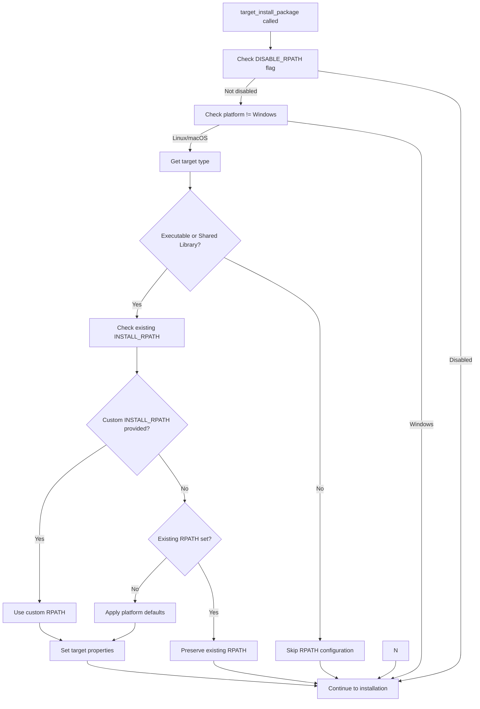

# RPATH Implementation Details

## Quick Reference

### New API Parameters

```cmake
target_install_package(TARGET_NAME
  # ... existing parameters ...
  
  DISABLE_RPATH                       # Disable automatic RPATH
)
```

### Implementation Location

**File:** `install_package_helpers.cmake`  
**Function:** `target_prepare_package()`  
**Location:** Before `install(${INSTALL_ARGS})` call (around line 700)

### Code Structure

```cmake
# Configure RPATH for Linux/macOS if not disabled
if(NOT ARG_DISABLE_RPATH AND NOT WIN32)
  get_target_property(TARGET_TYPE ${TARGET_NAME} TYPE)
  if(TARGET_TYPE STREQUAL "EXECUTABLE" OR TARGET_TYPE STREQUAL "SHARED_LIBRARY")
    # Logic here
  endif()
endif()
```

### Platform Defaults

| Platform | Executable RPATH | Library RPATH |
|----------|------------------|---------------|
| Linux | `$ORIGIN/../lib:$ORIGIN/../lib64` | `$ORIGIN/../lib:$ORIGIN/../lib64` |
| macOS | `@executable_path/../lib` | `@loader_path/../lib` |  
| Windows | None (N/A) | None (N/A) |

### Argument Parsing

```cmake
# In target_prepare_package()
set(options DISABLE_RPATH)
set(multiValueArgs ADDITIONAL_FILES ADDITIONAL_TARGETS PUBLIC_DEPENDENCIES PUBLIC_CMAKE_FILES COMPONENT_DEPENDENCIES)
```

### System Prefix Detection

RPATH is automatically skipped for system installations:

```cmake
function(is_system_install_prefix result)
  set(SYSTEM_PREFIXES "/usr" "/usr/local" "/System" "/Library")
  # Also includes Windows system paths
  # Checks if CMAKE_INSTALL_PREFIX matches any system prefix
endfunction()
```

**Detected system prefixes:**
- `/usr` and subdirectories  
- `/usr/local` and subdirectories
- `/System`, `/Library` (macOS)
- `C:/Program Files` (Windows)

## Testing Commands

### Build with Debug Logging
```bash
cmake -B build --log-level=DEBUG
# Look for: "[DEBUG] Set default INSTALL_RPATH for 'target': ..."
```

### Verify RPATH in Binary
```bash
# Linux
readelf -d path/to/binary | grep -E "(RPATH|RUNPATH)"

# macOS  
otool -l path/to/binary | grep -A2 LC_RPATH
```

### Test Installation
```bash
cmake --install build --prefix /tmp/test
/tmp/test/bin/myapp  # Should find libraries without LD_LIBRARY_PATH
```

## Working Examples

### Basic Shared Library
```bash
cd examples/basic-shared
cmake -B build --log-level=DEBUG 2>&1 | grep "Set INSTALL_RPATH"
# Output: Set default INSTALL_RPATH for 'string_utils': $ORIGIN/../lib:$ORIGIN/../lib64
```

### Complex Multi-target  
```bash
cd examples/components-same-export  
cmake -B build --log-level=DEBUG 2>&1 | grep "Set INSTALL_RPATH"
# Shows RPATH for executable and shared libraries
```

## Files Modified

1. **target_install_package.cmake:**
   - Added DISABLE_RPATH parameter to API documentation
   - Added DISABLE_RPATH usage example
   - Updated behavior description to mention automatic RPATH configuration

2. **install_package_helpers.cmake:**
   - Added DISABLE_RPATH to options parsing (line 74)
   - Added RPATH configuration logic before installation (lines 655-682)
   - Stores DISABLE_RPATH as target property for deferred evaluation

## Logic Flow



## Debug Output Examples

### Successful RPATH Configuration
```
-- [target_install_package][DEBUG] Set default INSTALL_RPATH for 'mylib': $ORIGIN/../lib:$ORIGIN/../lib64
-- [target_install_package][DEBUG] Set default INSTALL_RPATH for 'myapp': $ORIGIN/../lib:$ORIGIN/../lib64
```

### Custom RPATH (via CMAKE_INSTALL_RPATH)
```
-- [target_install_package][DEBUG] Using global CMAKE_INSTALL_RPATH for 'myapp': /opt/custom/lib
```

### Target-Specific RPATH
```
-- [target_install_package][DEBUG] Target 'myapp' already has INSTALL_RPATH: $ORIGIN/../vendor/lib
```

### System Installation (RPATH Skipped)
```
-- [target_install_package][DEBUG] Skipping RPATH for system installation to '/usr/local' for 'mylib'
-- [target_install_package][DEBUG] Skipping RPATH for system installation to '/usr/local' for 'myapp'
```

### Disabled RPATH
```
# No RPATH debug messages appear
```

## Implementation Notes

1. **DISABLE_RPATH Logic**: Correctly prevents RPATH from being set using target properties
2. **Respects User Configuration**: Only sets defaults when no RPATH is configured
3. **Platform Support**: Includes lib64 support for Linux distributions

## Installation Verification

### Successful RPATH Installation
```
-- Set non-toolchain portion of runtime path of ".../lib/libmylib.so" to "$ORIGIN/../lib:$ORIGIN/../lib64"
```

### Binary Verification
```bash
$ readelf -d lib/libmylib.so | grep RUNPATH
 0x000000000000001d (RUNPATH)    Library runpath: [$ORIGIN/../lib:$ORIGIN/../lib64]
```

This confirms the RPATH implementation is working correctly and the binary will search for dependencies in the expected location.