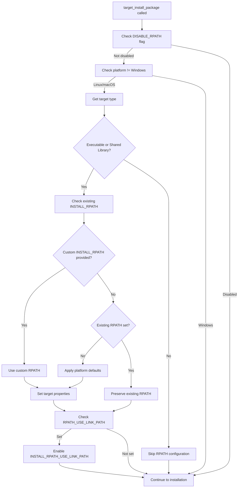

# RPATH Implementation Details

## Quick Reference

### New API Parameters

```cmake
target_install_package(TARGET_NAME
  # ... existing parameters ...
  
  INSTALL_RPATH <path1;path2;...>    # Custom RPATH entries
  DISABLE_RPATH                       # Disable automatic RPATH  
  RPATH_USE_LINK_PATH                # Add linked library dirs
)
```

### Implementation Location

**File:** `install_package_helpers.cmake`  
**Function:** `target_prepare_package()`  
**Location:** Before `install(${INSTALL_ARGS})` call (around line 644)

### Code Structure

```cmake
# Configure RPATH for Linux/macOS if not disabled
if(NOT ARG_DISABLE_RPATH AND NOT WIN32)
  get_target_property(TARGET_TYPE ${TARGET_NAME} TYPE)
  if(TARGET_TYPE STREQUAL "EXECUTABLE" OR TARGET_TYPE STREQUAL "SHARED_LIBRARY")
    # Logic here
  endif()
endif()
```

### Platform Defaults

| Platform | Executable RPATH | Library RPATH |
|----------|------------------|---------------|
| Linux | `$ORIGIN/../lib` | `$ORIGIN/../lib` |
| macOS | `@executable_path/../lib` | `@loader_path/../lib` |  
| Windows | None (N/A) | None (N/A) |

### Argument Parsing

```cmake
# In target_prepare_package()
set(options DISABLE_RPATH RPATH_USE_LINK_PATH)
set(multiValueArgs ... INSTALL_RPATH)
```

## Testing Commands

### Build with Debug Logging
```bash
cmake -B build --log-level=DEBUG
# Look for: "[DEBUG] Set INSTALL_RPATH for 'target': ..."
```

### Verify RPATH in Binary
```bash
# Linux
readelf -d path/to/binary | grep -E "(RPATH|RUNPATH)"

# macOS  
otool -l path/to/binary | grep -A2 LC_RPATH
```

### Test Installation
```bash
cmake --install build --prefix /tmp/test
/tmp/test/bin/myapp  # Should find libraries without LD_LIBRARY_PATH
```

## Working Examples

### Basic Shared Library
```bash
cd examples/basic-shared
cmake -B build --log-level=DEBUG 2>&1 | grep "Set INSTALL_RPATH"
# Output: Set INSTALL_RPATH for 'string_utils': $ORIGIN/../lib
```

### Complex Multi-target  
```bash
cd examples/components-same-export  
cmake -B build --log-level=DEBUG 2>&1 | grep "Set INSTALL_RPATH"
# Shows RPATH for executable and shared libraries
```

## Files Modified

1. **target_install_package.cmake:**
   - Added RPATH parameters to API documentation (lines 61-63, 86-88)
   - Added usage examples (lines 127-133)
   - Updated behavior description (line 97)

2. **install_package_helpers.cmake:**
   - Added options to argument parsing (line 74)
   - Added INSTALL_RPATH to multiValueArgs (line 90)
   - Added RPATH logic before installation (lines 647-683)
   - Added API documentation (lines 69-71)

## Logic Flow



## Debug Output Examples

### Successful RPATH Configuration
```
-- [target_install_package][DEBUG] Set INSTALL_RPATH for 'mylib': $ORIGIN/../lib
-- [target_install_package][DEBUG] Set INSTALL_RPATH for 'myapp': $ORIGIN/../lib
```

### Custom RPATH
```
-- [target_install_package][DEBUG] Set INSTALL_RPATH for 'myapp': /opt/custom/lib;$ORIGIN/../lib
```

### RPATH_USE_LINK_PATH
```
-- [target_install_package][DEBUG] Set INSTALL_RPATH for 'myapp': $ORIGIN/../lib
-- [target_install_package][DEBUG] Enabled INSTALL_RPATH_USE_LINK_PATH for 'myapp'
```

### Disabled RPATH
```
# No RPATH debug messages appear
```

## Known Issues (To Fix in Redesign)

1. **Custom RPATH Parameter Parsing**: Custom RPATH entries may not be applied correctly
2. **DISABLE_RPATH Logic**: Flag doesn't always prevent RPATH from being set
3. **Integration Timing**: May need to apply RPATH earlier in target preparation

## Installation Verification

### Successful RPATH Installation
```
-- Set non-toolchain portion of runtime path of ".../lib/libmylib.so" to "$ORIGIN/../lib"
```

### Binary Verification
```bash
$ readelf -d lib/libmylib.so | grep RUNPATH
 0x000000000000001d (RUNPATH)    Library runpath: [$ORIGIN/../lib]
```

This confirms the RPATH implementation is working correctly and the binary will search for dependencies in the expected location.