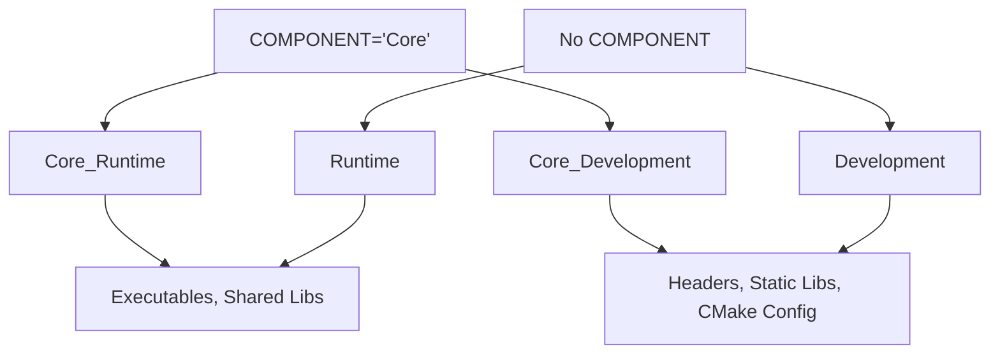

# Logical Components Design Document

**Project**: target_install_package.cmake  
**Feature**: Simplified Component Prefix Pattern  
**Version**: 6.0.0  
**Date**: 2025-08-31  
**Status**: Revised Design for Review

## Executive Summary

This document proposes a simplified logical component system using a **Component Prefix Pattern** that eliminates dual install complexity while providing clean logical grouping. This is a **breaking change** that prioritizes architectural simplicity over backward compatibility.

### Key Benefits
- **Eliminates Dual Install Complexity**: Removes complex routing logic entirely
- **Predictable Component Naming**: `PREFIX_Runtime`, `PREFIX_Development` pattern
- **Simplified Mental Model**: COMPONENT becomes an optional prefix, that's it
- **Clean CPack Integration**: Automatic logical component groups
- **User Controls Complexity**: Through clear documentation and examples

---

## Problem Statement

### Current System Issues
1. **Dual Install Complexity**: Complex logic routing same targets to multiple components
2. **Unpredictable Behavior**: Users confused by when dual install happens vs doesn't
3. **Implementation Complexity**: 60+ lines of complex dual install routing logic
4. **Limited Logical Grouping**: Cannot cleanly organize targets into functional areas

### User Requirements
```cmake
# Users want simple, predictable logical grouping:
target_install_package(core_lib COMPONENT Core)     # Creates: Core_Runtime, Core_Development
target_install_package(gui_lib COMPONENT GUI)       # Creates: GUI_Runtime, GUI_Development

# Result: Clean logical groups for CPack and find_package
find_package(MyProject COMPONENTS Core GUI)         # Gets Core + GUI logical groups
```

---

## Solution Architecture

### Core Innovation: Component Prefix Pattern

Replace complex dual install logic with a simple prefix pattern where COMPONENT becomes an optional prefix for standard Runtime/Development suffixes.



### Simple Two-Component Architecture

1. **Runtime Component**: `${PREFIX}_Runtime` or `Runtime` - executables and shared libraries
2. **Development Component**: `${PREFIX}_Development` or `Development` - headers, static libs, CMake configs
3. **CPack Groups**: Auto-detected from prefixes - each prefix becomes a logical group

---

## Detailed Design

### 1. API Design (Breaking Change)

#### Simplified Component Prefix API
```cmake
# NEW SIMPLE API:
target_install_package(core_lib 
    EXPORT_NAME MyProject
    COMPONENT Core)        # Creates: Core_Runtime, Core_Development

target_install_package(gui_lib 
    EXPORT_NAME MyProject
    COMPONENT GUI)         # Creates: GUI_Runtime, GUI_Development

# TRADITIONAL (unchanged behavior):
target_install_package(legacy_lib 
    EXPORT_NAME MyProject) # Creates: Runtime, Development
```

#### API Parameters

| Parameter | Type | Description | Example | Result Components |
|-----------|------|-------------|---------|-------------------|
| `COMPONENT` | String | Optional prefix for components | `Core`, `GUI`, `Tools` | `Core_Runtime`, `Core_Development` |
| (no COMPONENT) | - | Traditional behavior | - | `Runtime`, `Development` |

### 2. Installation Pattern

#### Simple Install Commands
```cmake
# With COMPONENT="Core":
install(TARGETS core_lib
    RUNTIME COMPONENT Core_Runtime           # Executables, shared libs
    LIBRARY COMPONENT Core_Runtime
    ARCHIVE COMPONENT Core_Development       # Static libs
    FILE_SET HEADERS COMPONENT Core_Development)  # Headers

# Without COMPONENT (traditional):
install(TARGETS legacy_lib  
    RUNTIME COMPONENT Runtime
    LIBRARY COMPONENT Runtime
    ARCHIVE COMPONENT Development
    FILE_SET HEADERS COMPONENT Development)
```

#### Component Detection Logic
```cmake
# Auto-detect logical groups from component names:
# Components: Core_Runtime, Core_Development, GUI_Runtime, GUI_Development
# Detected Groups: Core, GUI
# Group Core contains: Core_Runtime, Core_Development
# Group GUI contains: GUI_Runtime, GUI_Development
```

### 3. Consumer Interface Design

#### Simple Component Selection
```cmake
# Traditional (all targets):
find_package(MyProject REQUIRED)
# Result: All targets available

# Component-based selection:
find_package(MyProject REQUIRED COMPONENTS Core GUI)
# Result: Targets from Core and GUI logical groups

# Fine-grained selection:  
find_package(MyProject REQUIRED COMPONENTS Core_Runtime GUI_Development)
# Result: Only runtime files from Core, only development files from GUI
```

#### Target Creation (Unchanged)
```cmake
# Existing target naming continues to work:
MyProject::core_lib     # Target created from core_lib
MyProject::gui_lib      # Target created from gui_lib

# Consumer code unchanged:
target_link_libraries(myapp PRIVATE MyProject::core_lib MyProject::gui_lib)
```

### 4. CPack Integration Design

#### Automatic Component Group Detection
```cmake
# From components: Core_Runtime, Core_Development, GUI_Runtime, GUI_Development
# Auto-generate CPack groups:

cpack_add_component_group(Core
    DISPLAY_NAME "Core Components"  
    DESCRIPTION "Essential functionality"
    EXPANDED)

cpack_add_component(Core_Runtime
    GROUP Core
    DISPLAY_NAME "Core Runtime"
    DESCRIPTION "Core libraries and executables")

cpack_add_component(Core_Development  
    GROUP Core
    DEPENDS Core_Runtime
    DISPLAY_NAME "Core Development"
    DESCRIPTION "Core headers and development files")

# Same pattern for GUI, Tools, etc.
```

---

## Implementation Plan

### Phase 1: Remove Dual Install Complexity ⭐ **Start Here**
**Complexity**: 30/100 | **Duration**: 1-2 days | **Risk**: Medium (Breaking Change)

**Changes Required**:
- Remove dual install logic from `install_package_helpers.cmake` (~60 lines)
- Simplify `_build_component_args()` to use prefix pattern  
- Remove `TARGET_*_DUAL_INSTALL` logic entirely

**Success Criteria**:
- Single install() command per target
- Predictable component naming: `PREFIX_Runtime`, `PREFIX_Development`
- No complex routing logic

### Phase 2: Component Prefix Implementation ⭐
**Complexity**: 25/100 | **Duration**: 1-2 days | **Risk**: Low

**Changes Required**:
- Modify component name generation to use prefix pattern
- Update `_collect_export_components()` for new naming
- Test with simple examples

**Success Criteria**:
- `COMPONENT="Core"` creates `Core_Runtime`, `Core_Development`
- No COMPONENT creates `Runtime`, `Development` (traditional)
- All install commands work correctly

### Phase 3: Enhanced export_cpack.cmake ⭐
**Complexity**: 35/100 | **Duration**: 2-3 days | **Risk**: Medium

**Changes Required**:
- Auto-detect logical groups from component naming pattern
- Generate CPack component groups automatically  
- Set up component dependencies (`*_Development` depends on `*_Runtime`)

**Success Criteria**:
- CPack automatically creates logical component groups
- Proper component relationships and descriptions
- Works with both prefixed and traditional components

### Phase 4: Update Examples and Documentation
**Complexity**: 20/100 | **Duration**: 1-2 days | **Risk**: Low

**Changes Required**:
- Update example projects to use new API
- Create migration guide for breaking changes
- Document new patterns clearly

**Success Criteria**:
- Examples demonstrate logical component usage
- Clear migration path for existing users
- Comprehensive usage documentation

---

## Testing Strategy

### Breaking Change Testing
- **Primary Goal**: Validate that breaking changes work as expected
- **Migration Testing**: Existing examples updated to new API work correctly
- **Regression Prevention**: No unintended behavior changes beyond the breaking change

### New Feature Testing

#### Phase 1-2 Tests
```cmake
# Test component prefix pattern:
target_install_package(core_lib EXPORT_NAME TestProject COMPONENT Core)
# Expected: Core_Runtime, Core_Development components

target_install_package(legacy_lib EXPORT_NAME TestProject)
# Expected: Runtime, Development components (traditional)
```

#### Phase 3 Tests
```cmake
# Test CPack group auto-detection:
# Components: Core_Runtime, Core_Development, GUI_Runtime, GUI_Development  
# Expected CPack Groups: Core (contains Core_*), GUI (contains GUI_*)
```

#### Phase 4 Tests
```cmake
# Test find_package component selection:
find_package(TestProject COMPONENTS Core GUI)
# Expected: Gets targets from both Core and GUI groups
```

---

## Migration Strategy

### Breaking Change Impact
**Impact**: Existing examples need updating to work with new system

**Before (v5.x)**:
```cmake
target_install_package(mylib 
    EXPORT_NAME MyProject
    COMPONENT tools)  # Created dual install complexity
```

**After (v6.0)**:
```cmake  
target_install_package(mylib
    EXPORT_NAME MyProject
    COMPONENT Tools)  # Creates: Tools_Runtime, Tools_Development
```

### Migration Steps
1. **Update COMPONENT usage**: Review custom component names, ensure they work as prefixes
2. **Remove dual install assumptions**: Code expecting targets in multiple components needs adjustment
3. **Update find_package calls**: Component names now include suffixes (`Tools_Runtime` vs `tools`)
4. **Test CPack integration**: Component groups may change with new naming

---

## Technical Implementation Details

### File Changes Required

| File | Changes | Complexity |
|------|---------|------------|
| `target_install_package.cmake` | None (delegation only) | - |
| `install_package_helpers.cmake` | Remove dual install, add prefix logic | Medium |
| `export_cpack.cmake` | Add logical group auto-detection | Medium |
| `generic-config.cmake.in` | Update component resolution (if needed) | Low |

### Examples Requiring Updates
- `components/` - Update COMPONENT usage to prefix pattern
- `components-same-export/` - Simplify with new prefix pattern  
- All examples using custom COMPONENT parameters

### Removed Complexity
```cmake
# REMOVED: Complex dual install logic (~60 lines)
# REMOVED: TARGET_RUNTIME_COMPONENT_DUAL_INSTALL
# REMOVED: TARGET_DEV_COMPONENT_DUAL_INSTALL  
# REMOVED: Secondary install() commands
# REMOVED: Complex routing in _build_component_args()
```

---

## Risk Assessment

### Low Risk ✅
- **Simplified Architecture**: Removing complexity reduces maintenance burden
- **Predictable Behavior**: Clear prefix pattern eliminates user confusion
- **CPack Integration**: Auto-detection is straightforward pattern matching

### Medium Risk ⚠️
- **Breaking Change**: Existing users need to update their code
- **Example Migration**: All examples with COMPONENT need updating
- **Component Name Changes**: CPack components will have different names

### High Risk 🔴
- **User Migration Effort**: Breaking changes require user action
- **Documentation Gap**: Need comprehensive migration guide
- **Ecosystem Impact**: Downstream projects using custom components affected

### Mitigation Strategies  
1. **Clear Migration Guide**: Document exactly what users need to change
2. **Version Increment**: Major version bump (6.0) signals breaking change
3. **Gradual Rollout**: Test with examples before broader release
4. **Comprehensive Documentation**: Examples showing old vs new patterns

---

## Success Metrics

### Functional Success
- [ ] All updated examples work correctly with new prefix pattern
- [ ] CPack automatically generates logical component groups
- [ ] Component naming is predictable: `PREFIX_Runtime`, `PREFIX_Development`
- [ ] Single install() command per target (no dual install complexity)

### Performance Success  
- [ ] Configuration time improved (due to removed complexity)
- [ ] Memory usage decreased (less metadata tracking)
- [ ] Installation time unchanged or improved

### Quality Success
- [ ] Breaking changes clearly documented with migration guide
- [ ] Simplified codebase (60+ lines of complex logic removed)
- [ ] Clear, predictable user mental model
- [ ] Better maintainability through reduced complexity

---

## Future Enhancements

### Version 6.1 Potential Features
- **Smart Component Detection**: Auto-suggest logical component names from target names
- **Component Dependencies**: Support logical component dependency declaration
- **Conditional Components**: Platform-specific component inclusion/exclusion

### Long-term Possibilities
- **Enhanced CPack Integration**: Custom component descriptions and relationships
- **Package Manager Features**: Better vcpkg/Conan component mapping
- **Component Validation**: Ensure logical consistency across related components

---

## Conclusion

The Component Prefix Pattern provides a clean, simplified solution to logical component grouping that:

1. **Eliminates complexity**: Removes 60+ lines of confusing dual install logic
2. **Provides predictable behavior**: COMPONENT becomes a simple prefix, that's it
3. **Enables logical grouping**: CPack automatically creates component groups
4. **Simplifies maintenance**: Clear, understandable codebase with fewer edge cases

The breaking change approach prioritizes long-term architectural health over short-term compatibility, resulting in a system that's easier to use, maintain, and extend.

### Key Trade-offs Made
- **Breaking Change**: Accepted to eliminate architectural debt
- **User Migration**: Required but straightforward with clear patterns  
- **Simplified Features**: Removed complex routing in favor of predictable behavior
- **Documentation Focus**: Users handle complexity through examples and clear docs

---

**Document Status**: Revised Design for Review  
**Next Steps**: Review simplified approach, then proceed with Phase 1 implementation  
**Dependencies**: None - breaking change removes dependencies on existing complexity